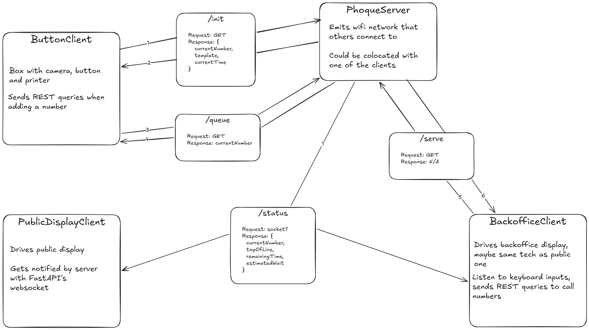

# Phoque2
This is an evolution of the [Phoque](https://github.com/Timst/Phoque) system, focused on decoupling various functionalities of the original one.

## Wait so what is this?
You can read the other's repo readme for more details, but the TL;DR is that this is a queuing system that I created for my Burning Man camp, Crêpiphany. At most camps, people have to line up and wait to receive a camp's offering, sometimes for hours on end. This is highly unpleasant. With Phoque, people can get a ticket, sit down, and wait to be called.

It works like this:
- Guests walk up to a big arcade push button, press it, and the system takes a picture and print it (along with a number) on a receipt printer
- When ready, we can call numbers by pressing another button on our side
- Meanwhile, a screen shows the current number and expected wait time

## So what was wrong with v1

Phoque v1 ran everything from the same RPI, which created some logistical headache: for example, we would have liked the guest button to be at the front of the camp, while the calling button are by the cooking station, but that just wasn't easily feasible. For the number screen, we used a wireless HDMI thing, but that was rickety as hell. And then the client/server model used for said screen was also ridiculous. This is an attempt to make this a cleaner, fully distributed system. Diagram:

The new system will rely on at least three independent Pis:

- The existing Rapberry Pi 5 will:
  - Operate the guest button, webcam and printer
  - Emit a wifi network for the other devices to connect to
  - Run a server with a REST endpoint used by everything else
  - **Code**: everything under `phoque-button` and `phoque-server`

- A new Raspberry Pi Zero 2W will:
  - Run the "backoffice", including a screen shown to us with the current status of the line etc.
  - Call numbers using [RF433 clickers](https://www.amazon.com/dp/B0DFXRVJ5L)
  - **Code**: everything under `phoque-backoffice`

- Another Zero 2W will:
  - Run the screen, which will no longer be a standard TV but will instead be an [LED matrix](https://www.walmart.com/ip/AZERONE-P10-Led-Matrix-Outdoor-Waterproof-Screen-1-4scan-SMD3535-3in1-RGB-Full-Color-LED-Display-Module-Panel-Board-320x160mm-32x16-Pixels-RGB-Full-C/17004771717) driven by a [HUB75 module](https://www.amazon.com/dp/B0FBKYYP15)
  - Also call numbers on the speakers
  - **Code**: everything under `phoque-display`

The Pi units will be linked to one another with CAT6 cables, which will provide both power (using a PoE switch) and a data link.

Shared types and whatnot will be under `shared`.